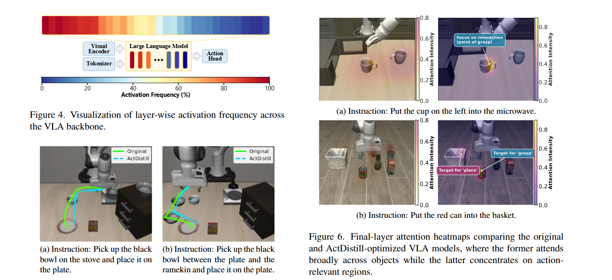

# ActDistill: General Action-Guided Self-Derived Distillation for Efficient Vision-Language-Action Models


## Overview

Code Implementation of [ActDistill](https://arxiv.org/abs/2511.18082)
**ActDistill** (Action-Guided Knowledge Distillation) is a framework for distilling large Vision-Language-Action (VLA) policies into lighter student policies while preserving both semantic understanding and precise robot actions.

The codebase builds on top of Prismatic / OpenVLA-style VLAs and CogACT diffusion policies, adding explicit action-guided routing and graph-structured semantic supervision.



---


## Method at a Glance

- **Action-Guided Dynamic Routing**  
  The LLaMA backbone is augmented with a learned router that decides, per layer, how much computation to allocate conditioned on action semantics instead of only token complexity. A small number of layers can be “skipped” (see the backbone code for details).

- **Graph-Structured Semantic Extraction**  
  At each transformer layer, token features are fed into a GNN-based extractor that builds a k-NN graph and aggregates node features into a compact semantic vector. This is implemented in `prismatic/models/semantic/gnn_extractor.py`.

- **Dual-Stream Distillation**  
  Distillation is carried out along two streams:
  - **Semantic stream**: aligns per-layer semantic vectors between teacher and student (instance + relational structure).
  - **Action stream**: matches per-layer action predictions via a “triple MSE” loss (student ↔ teacher ↔ ground truth).

- **Layer-Wise Adaptive Weighting**  
  Distillation losses are re-weighted with depth using an exponent `γ`, increasing emphasis on deeper transformer layers. The weighting and loss aggregation live in `training/losses/actdistill_loss.py`.

---

## Environment & Installation

### Requirements 
- Python 3.10
- CUDA-capable GPU(s) with enough memory for a 7B-scale VLM + diffusion head
- PyTorch ≥ 2.2 with matching CUDA toolkit (the provided environment assumes CUDA 12.8)

The file `environment.yml` describes a working conda environment, including:

- Core stack: `pytorch`, `torchvision`, `torchaudio`, `transformers`, `accelerate`
- Project dependencies: `prismatic`, `openvla`, `cogact`, `ray`, `wandb`, etc.


```bash
conda env create -f environment.yml
conda activate actdistill
```

---

## Training Pipeline

ActDistill is designed as a **two-stage** protocol.

### Step 0: Assets

- **Pretrained VLA checkpoint**  
  A CogACT / Openvla checkpoint with keys for at least:
  - `model["projector"]`
  - `model["llm_backbone"]`
  - optionally `model["vision_backbone"]`
  - and, for full ActDistill, `model["action_model"]`

- **Dataset**  
   Download the dataset you want to train on, and pay attention to formats to keep consistent with code.
---

### Stage 1: Teacher Semantic Probing

Goal: train GNN semantic heads and per-layer action heads on a **frozen teacher** VLA, and cache teacher outputs for all training examples.

Script: `scripts/train_teacher_probing.py`  
Key roles:

- Freezes backbone, unfreezes `gnn_semantic_heads` and `action_heads` in the LLM backbone.
- Trains a simple MSE-based preparation loss to make per-layer action heads predictive of ground-truth actions.
- After training, runs the dataset once in a deterministic order and saves, for each batch and layer:
  - semantic features
  - action predictions

Typical invocation shape (arguments abbreviated):

```bash
python scripts/train_teacher_probing.py \
  --teacher_checkpoint PATH/TO/COGACT_CKPT.pt \
  --data_root_dir PATH/TO/OPENX_ROOT \
  --output_dir checkpoints/actdistill_stage1 \
  # plus optional flags: --epochs, --batch_size, --device, --num_workers ...
```

**Stage 1 outputs** (under `output_dir`):

- `semantic_heads_final.pth` — trained semantic/action heads
- `teacher_outputs_cache/`
  - `batch{N:06d}_layer{L:02d}_semantic.pt`
  - `batch{N:06d}_layer{L:02d}_action.pt`
  - `metadata.pt` (number of batches, layers, and batch size)

The caching scheme assumes the same dataset ordering will be used in Stage 2 (see below).

---

### Stage 2: Student Distillation with ActDistill

Goal: train the student VLA with:

- dynamic routing enabled in the LLaMA backbone;
- dual-stream distillation against pre-computed teacher outputs.

There are two entry points:

1. **Orchestrator script**: `train_actdistill.sh`  
   Wraps Stage 1 and Stage 2 into a single flow. 

   The script is also responsible for setting a few key environment variables (`USE_ACTDISTILL`, `BALANCE`, distillation weights, etc.) before launching training.

2. **Direct Stage 2 script**: `scripts/train.py`  
    When called through `train_actdistill.sh`, it is roughly equivalent to a `torchrun` invocation of the form:

   ```bash
   torchrun --standalone --nnodes 1 --nproc-per-node WORLD_SIZE scripts/train.py \
     --vla.type prism-dinosiglip-224px+oxe+diffusion \
     --data_root_dir DATA_ROOT \
     --run_root_dir RUN_ROOT \
     --pretrained_checkpoint PRETRAINED_CHECKPOINT \
     --teacher_cache_dir TEACHER_OUTPUT_CACHE_DIR \
     # plus VLAConfig overrides: batch size, lr, epochs, etc.
   ```


---

## Code Structure

Core directories (non-exhaustive):

```text
ActDistill/
├── conf/
│   └── vla.py                  # VLAConfig & VLARegistry definitions
├── vla_backbone/
│   └── modeling_llama.py       # LLaMA backbone with routing, GNN hooks, per-layer heads
├── vla/
│   ├── cogactvla.py            # CogACT wrapper around PrismaticVLM + diffusion head + ActDistill logic
│   └── load.py                 # Helpers for loading VLA models / checkpoints
├── training/
│   ├── losses/
│   │   └── actdistill_loss.py  # ActDistill loss (semantic + action streams)
│   ├── strategies/
│   │   ├── base_strategy_cogact.py  # Training loop (VLA + diffusion + distillation)
│   │   └── fsdp.py             # FSDP-based training strategy
│   └── metrics.py              # Metrics / trackers for generic + VLA training
├── prismatic/
│   ├── models/
│   │   ├── vlms/prismatic.py   # Base PrismaticVLM
│   │   └── semantic/
│   │       └── gnn_extractor.py  # GNN-based semantic extractor (k-NN graph + GAT)
│   ├── vla/
│   │   └── datasets/cached_teacher_dataset.py  # Dataset wrapper for teacher caches
│   └── util/
│       └── data_utils.py       # Collators for LM training and action prediction
├── action_model/
│   ├── action_model.py         # Diffusion action model wrapper (DiT + Gaussian diffusion)
│   └── ...                     # DiT variants, diffusion utilities
├── scripts/
│   ├── train_teacher_probing.py  # Stage 1: teacher semantic probing + cache
│   └── train.py                  # Stage 2: VLA + ActDistill training
└── train_actdistill.sh         # Convenience orchestrator for Stage 1 + Stage 2
```

---

## Practical Notes & Tips

- **Dynamic Routing**  
  The routing behavior is fully learnable - the model automatically learns which layers to execute or skip based on the vision-language routing module. During training, soft gating is used (weighted execution), while during inference, hard gating enables true layer skipping for computational efficiency. The balance loss in `vla_backbone/modeling_llama.py` ensures routing decisions remain diverse.

- **Teacher Caches**  
  Stage 2 assumes the teacher cache is aligned with the dataset ordering used in Stage 1. If you change batching / shuffling behavior, regenerate the cache or carefully inspect `CachedTeacherDataset`.

- **Tracking & Logging**  
  JSONL logging is enabled by default. W&B integration is available but assumes you are comfortable configuring `wandb` credentials and network access.

- **Hardware**  
  The default configs were written with multi-GPU machines in mind, but the code itself does not hard-code a specific world size. `GPU_IDS` and `--vla.expected_world_size` should be tuned to your hardware and tolerance for training time.

---

This README is intended as a high-level map of the system rather than a fully scripted tutorial. For exact hyperparameters and experiment details, please consult the configuration classes, scripts, and comments in the code. 


## Citation
Ye, W., Wang, T., Zhu, L., Li, F., & Yang, G. (2025). *ActDistill: General Action-Guided Self-Derived Distillation for Efficient Vision-Language-Action Models*. Retrieved from [https://arxiv.org/abs/2511.18082](https://arxiv.org/abs/2511.18082)

### BibTeX:
@misc{ye2025actdistillgeneralactionguidedselfderived,
      title={ActDistill: General Action-Guided Self-Derived Distillation for Efficient Vision-Language-Action Models}, 
      author={Wencheng Ye and Tianshi Wang and Lei Zhu and Fengling Li and Guoli Yang},
      year={2025},
      eprint={2511.18082},
      archivePrefix={arXiv},
      primaryClass={cs.CV},
      url={https://arxiv.org/abs/2511.18082}, 
}
